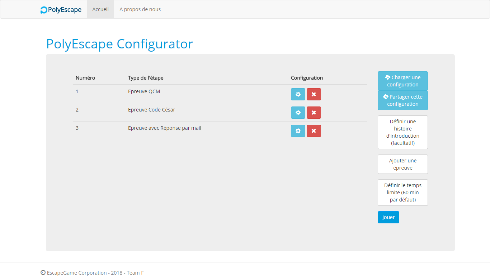
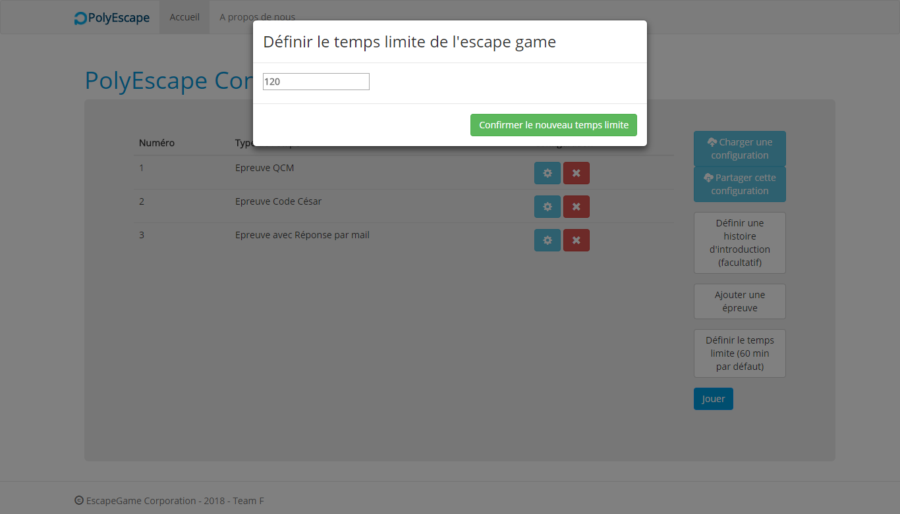
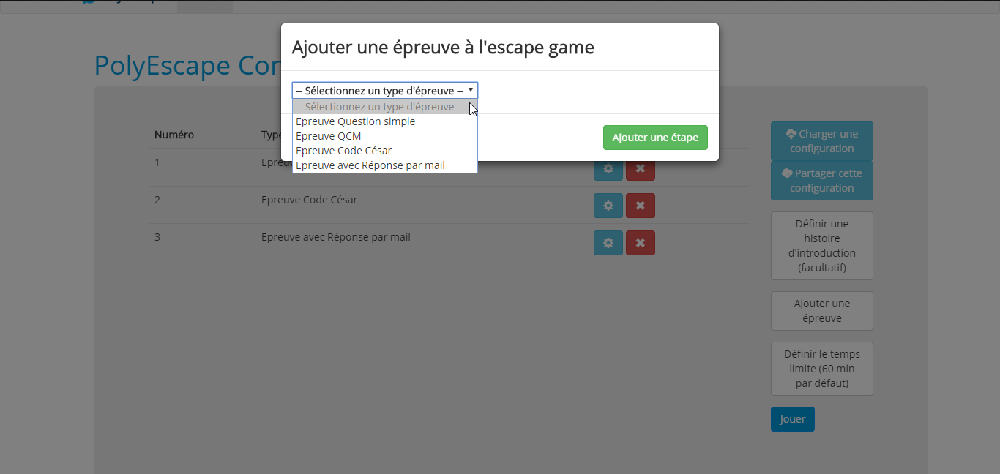
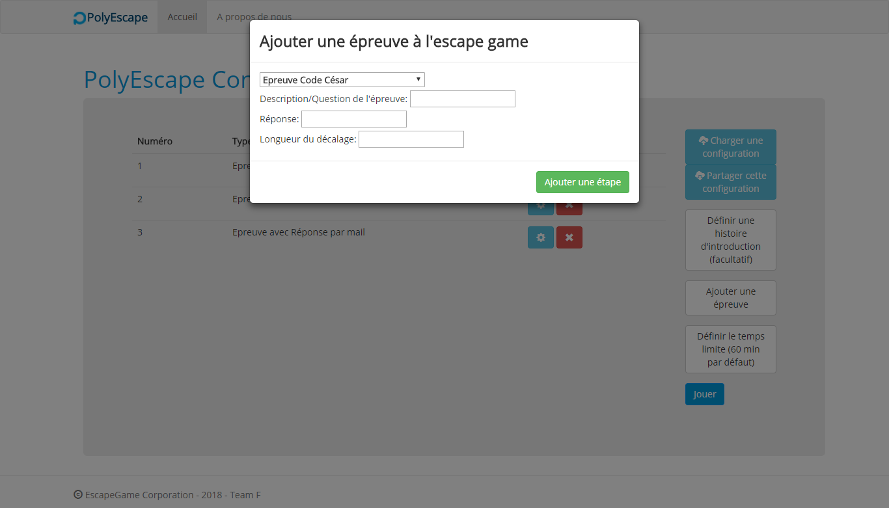
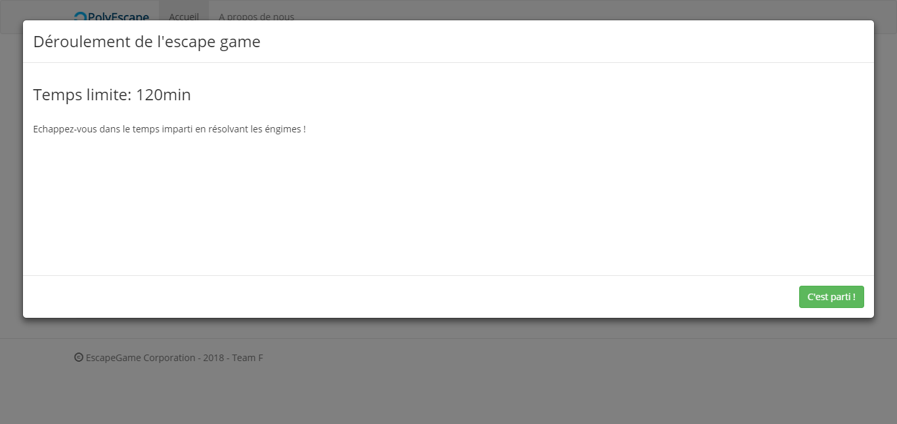
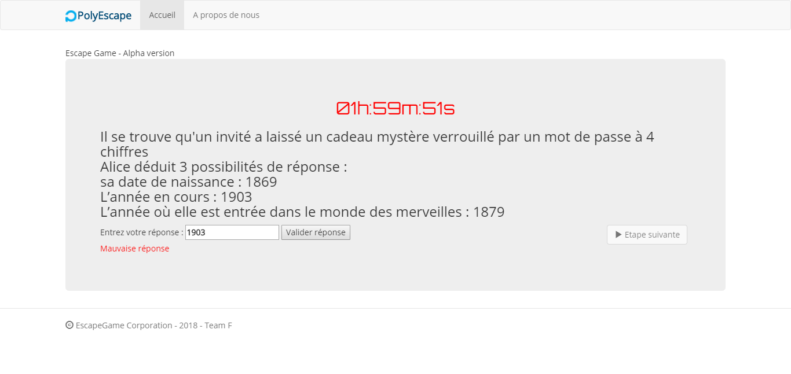
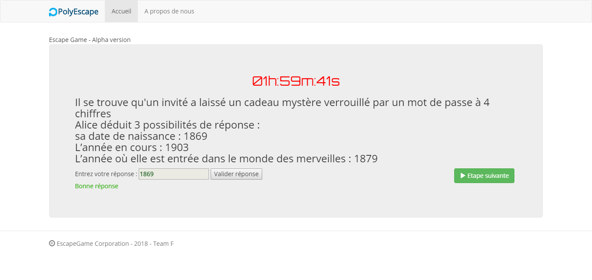
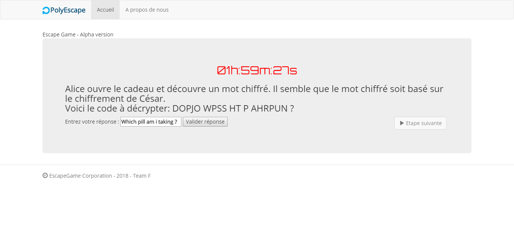
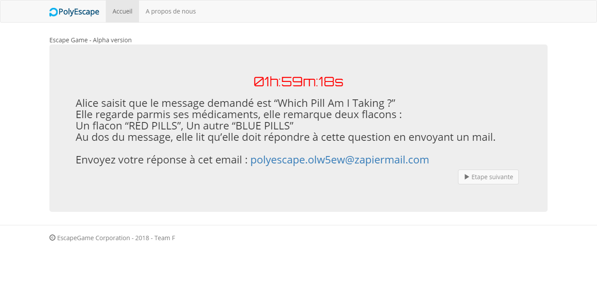

# PolyEscape (Team F)

Ce projet s'est déroulé pendant le mois de Janvier 2018, le sujet portait sur le développement d'une application permettant de créer des *escape games*.
Nous avions deux axes orientés **Architecture Logicielle** sur lesquels notre projet devait s'appuyer :
- Extensibilité & Interopérabilité (Appeler et être appelé par des services externes)
- Usine Logicielle & Armée de clones (Création de plugins)

Ce projet est composé de deux parties :
* Une API REST codée avec Jersey (JAX-RS) qui interagit avec des services externes.
* Une interface web codée en AngularJS qui sert seulement à démontrer que notre API est utilisable.

## Screenshots







### Pré-requis

* Java 8
* maven
* Node.js
* grunt
* bower

### Lancement du serveur :

```bash
cd polyescape_engine
mvn install && mvn tomcat7:run-war
```
Serveur lancé par défaut sur le port 8080


### Lancement de l'interface utilisateur :

```bash
cd polyescape_website

    //Si grunt et bower ne sont pas installés
    npm install -g grunt
    npm install -g bower

npm install
bower install
grunt serve
```
Interface lancée par défaut sur le port 9000

### Documentation du moteur de jeu:

```bash
cd doc
./index.html
```

### Gestion de la documentation (avec apidoc)

* Installation d'*apidoc*

```bash
npm install -g apidoc
```

* Régénération de la documentation


```bash
apidoc -i polyescape_engine
```

### Notes
* Services utilisés:
    * Zapier
    * API de chiffrement en code César faite par moi-même.
* Exemples de configuration d'Escape Games disponibles dans *escape_games_cfg_samples*
* Pour plus d'informations sur l'API REST, voir le README [ici](polyescape_engine/README.md).
* Pour plus d'informations sur l'interface, voir le README [ici](polyescape_website/README.md).
